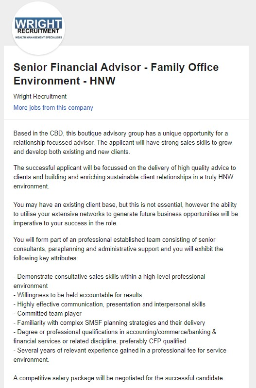
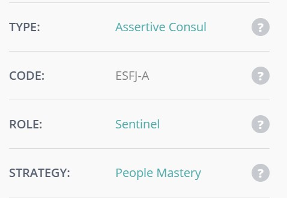
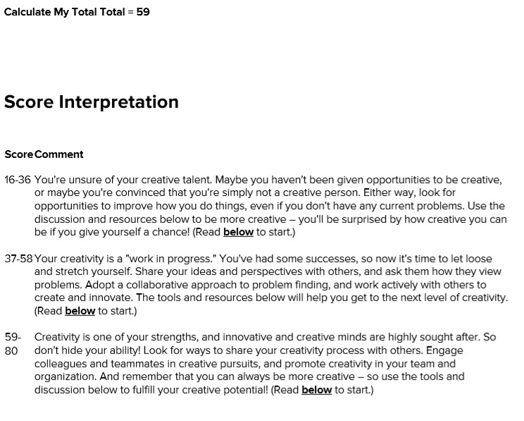
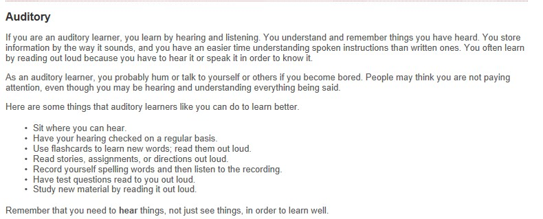
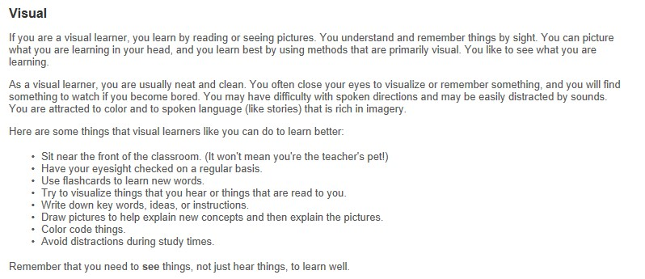

<html>
<head>
</head>
<body>

<h1>MY IT PROFILE</h1> 

<h2>ABOUT ME</h2>

Tayla Jean Surmon
Student ID: S3801846
Email: s3801846@student.rmit.edu.au 

I am 24 years old born in Australia. My Mum is from Sydney and my Dad is from Papua New Guinea. I have 3 Older brothers and no sisters. 
The only language that I know how to speak is English. I completed my year 12 certificate at St. Mary’s Catholic College in Cairns in 2012. 
I have a Tier 2 in General Insurance Broking and currently working towards my Tier 2 in Banking. I have a dog named Bruce and a cat named Mitsy who I absolutely adore. 
Up until 2013 I was a Gymnast/Trampolinist and extremely enjoyed it. My early retirement from Gymnastics/Trampolining came in 2013 when I decided that my knees and 
body was no longer able to take the harsh impact of the sport.

<h3>HOW MY INTEREST IN IT BEGAN</h3>

Growing up I would say that I was one of the less fortunate kids in my area. We didn’t have high tech things such as dial-up broadband. 
   We dd however have a computer that looked like something you would pull from the 1980’s. My interest in IT started when I was playing around 
   with a simple product which was on nearly every computer called Paint. Paint was my life. At the young age of 6 I would sit in our spare room 
   on the computer playing around with paint for hours on end, trying to work out how it worked and all the different aspects of it. 
   To some people you may be thinking “this has nothing to do with IT”, but to me it does. This is what started my interest in mobile phones and 
   gaming consoles which all have something to do with IT. I may not be able to tell you what DOS means or how much Ram my computer has, 
   but I can help you with setting it up and getting it working and showing the in’s and out’s that you need to use your computer. 

   I chose to study at RMIT because they are ranked in the top 250 Universities around the world. RMIT was the perfect choice for me not only 
   because of their high ranking, but because they had the ideal course that I was looking to study which no other University would offer online. 
   During my studies with RMIT I expect to learn the in’s and out’s of how to run a business (including the IT side of things) and how to be 
   a successful Financial Advisor.

<h4>MY IDEAL JOB</h4>

<a href="https://www.seek.com.au/job/39226215?type=standout&searchrequesttoken=5a95fbc2-8a37-44cc-a4af-f065810c23cc">Senior Financial Advisor - Family Office Environment - HNW</a> 

The role as a Senior Financial Advisor – Family Office Environment, is a position that highly interests me. This is a role that ideal to 
   showcase my excellent track record of Consultative Sale Skills, being able to hold myself accountable for the results I provide, wow my colleagues 
   with my outstanding communication, presentation and interpersonal skills as well as show that I can work individually as well as in a team 
   environment. Although at this point in time I have very limited knowledge in this industry, I have worked as an Insurance Brokers for 3 years and 
   currently working in a big 4 bank as a personal banker. By participating and completing my Bachelor of Business majoring in Financial Planning I 
   believe that this is just one small leap that I need to take to begin my journey to be a successful Senior Financial Advisor.

   
<h5>LEARNING STYLES</h5>

The Myers and Briggs Personality Test (Courtesy of 16Personalities)

   
   

   Creativity Test (Courtesy of MindTools)
   
   

   
   What is your Learning Style (Courtesyof EducationPlanner.org
   
   
   
   

   
<h6>WHAT HAVE I DISCOVERED ABOUT MY PERSONALITY, CREATIVNESS AND LEARNING STYLES</h6>

• Taking the Myers and Briggs personality test, didn’t really explain things about myself that I didn’t already know, 
     however I did learn that when it comes to approaching work, planning and decision making I am what they call “Judging” 
	 meaning that I am decisive, thorough and highly organized. I Value clarity, predictability, closure, preferring structure and 
	 planning to spontaneity. 
	 
   • In my Creativity test I learnt that creativity is one of my many strengths and innovative and crative minds are highly sought after. 
     To my this came as a shock as I personally didn’t think I was a very creative person. Knowing this now means that I can put my 
	 creativeness into action and start engaging more. 
	 
   • Learning that I am a person who needs to see and hear things to be able to learn doesn’t surprise me. Throughout high school I found that 
     not only did I have to hear my teachers or peers say something, I also had to read it either out loud or in my head before I 
	 fully understood what I was learning.

<h7>MY PROJECT IDEA - MISUSE OF PRESCRIPTION DRUGS</h7>

In Australia the use of prescription drugs is an increasing problem. Pharmaceutical drugs have been the highest recurrent contributor to 
   overdose deaths within Australia. Australians who are affected by the dependence of prescription drugs find themselves going from doctor to 
   doctor and pharmacy to pharmacy every day to assist in feeding their addiction. In saying that, this project idea would need to be applied by 
   pharmacists using a computer program that they all must. This program would provide them the ability to search using the customer’s details 
   and find out where else they have been to collect this drug as well as when they last filled a prescription. This is a system that would need 
   to be executed in every pharmacy in Australia and always be used to update the patient records of how often the drugs are being acquired and 
   used. 

   Not only is this an snowballing issue in Australia, but a worldwide issue which is an growing concern to all governments. A survey which 
   was completed in 2013 found that 4.8% of Australian Adults were using prescription drugs for non-medical purposes. The amount of people in syringe
   and needle programs who have testified that the most recent drug they used to inject themselves with was a prescription opioid amplified 
   from 7% in 2000 to 23% in 2015. This study also found that the 2 most commonly abused drugs were analgesics and sedatives. 
   The reason these 2 drugs are the most commonly used is because they stimulate the reward section in the brain by increasing the level of 
   dopamine neurotransmitter levels, which creates the feeling of pleasure and relief of dysphoria. 

   By implementing this service to pharmacies, they would all need to have a protected internet connection which would be linked to a certain 
   server which is based in the cloud. This server would be available 24 hours a day 7 days a week. This system would work by all pharmacists 
   (or pharmacist assistants) inputting the details of all of their clients and the drug that was prescribed to them. Yes, this may take a bit of 
   extra time for the pharmacist or pharmacist assistant, however it would assist in decreasing the abuse of prescription drugs. As this would 
   be a live system that would be hosted by a government agency, all the data that is entered into the system would be live as soon as it is 
   entered, thus there would be no down-time. If an abuser is going from doctor to doctor and pharmacy to pharmacy this would be an excellent 
   program to guarantee that abusers aren’t able to feed their addictions by abusing the medical professions, as they would be red flagged in the 
   system. 

   This type of service would necessitate each pharmacy to have a securely connected computer, which the government would make compulsory to 
   operate. Unfortunately, this means that pharmacies would have to invest a bit of money and time into obtaining these specialised computers or 
   they would be unable to remain operating. As this service is a program that would hold sensitive information about customers, it is highly 
   important that the software development for this program is exceedingly secure.

   There are many skills and talents that would be essential to make this project a effective one. Everything from project managers, software 
   developers and computer installers that have experience installing computers that have a secure internet connection. The team of project managers 
   would need to have a lot of experience and knowledge in every area of network design. The software developers also need to have a lot of 
   experience as they have to work together to create a extremely secure program that is to be run off the cloud. Not only does the program have 
   to be secure to protect the confidential customer information, it also needs to be able to generate red flags when it sees there is a misuse or 
   high use of prescription drugs. 

   If this project idea was successful in being created it would have a enormous impact on the diverse communities in Australia, as it would see 
   an instantaneous decrease in the prescription drug abuser community. This system will help ensure that patients are filling their prescriptions 
   appropriately and at the recommended time by a doctor (for example, if a patient is prescribed an opioid drug, they are only able to refill 
   this prescription every 30 days, therefore a red flag would be applied with a patient attempts to refill the script before then). This system 
   would be one of a kind as it would be assisting with reducing the amount of prescription drug deaths and overdoses within the Australia 
   community. This would then further assist doctors with being able to see those patients who truly need their care and attention and reduce 
   the number of pointless visits from prescription drug abusers.

   
<h8>REFERENCES</h8>

16 Personalities. 2011-2019. Free Personality Test. NERIS Analytics Limited. 
<a href="https://www.16personalities.com/free-personality-test">Free Personality Test</a> 
   
   EducationPlanner.Org. 2011. What’s Your Learning Style?. Pennsylvania Higher Education Assistance Agency. 
<a href="http://www.educationplanner.org/students/self-assessments/learning-styles-quiz.shtml">What's Your Learning Style? 20 Questions</a> 

   Mindtools.com. 2019. How Creative Are You?. Mind Tools Essential skills for an Excellent Career. 
<a href="https://www.mindtools.com/pages/article/creativity-quiz.htm">How Creative Are You?</a>    

   Benny Monheit, Danusia Pietrzak and Sandra Hocking. 2016. Prescription Drug Abuse – A timely update. A Family Physician. 
<a href="https://www.racgp.org.au/afp/2016/december/prescription-drug-abuse-a-timely-update/">Prescription drug abuse – A timely update</a>

</html>
